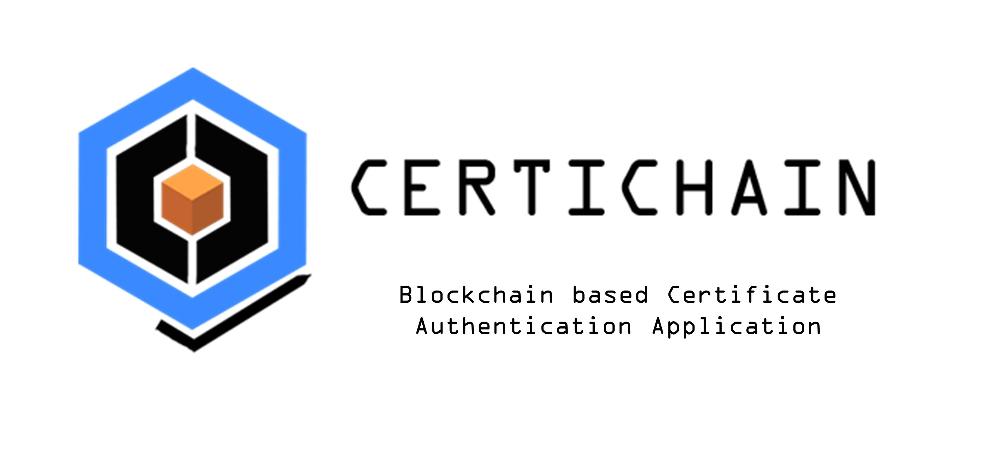
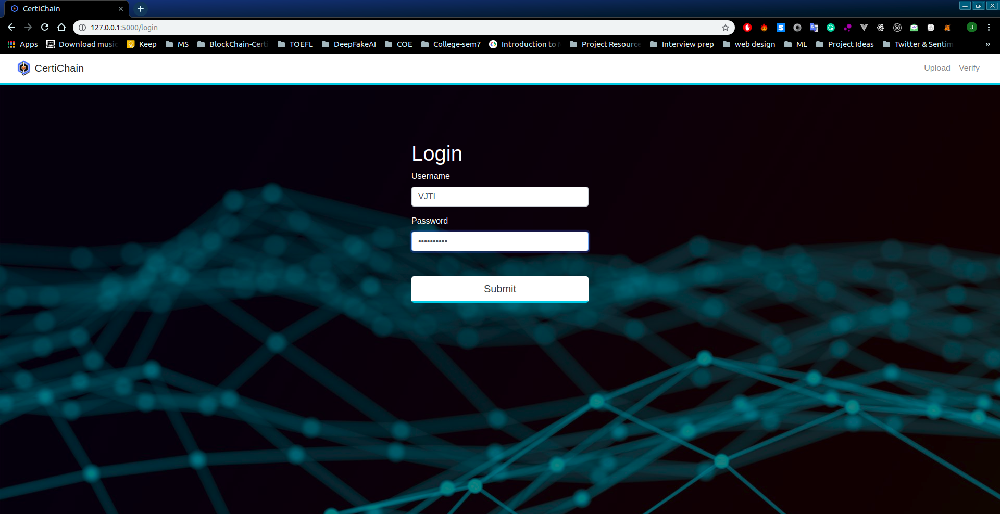
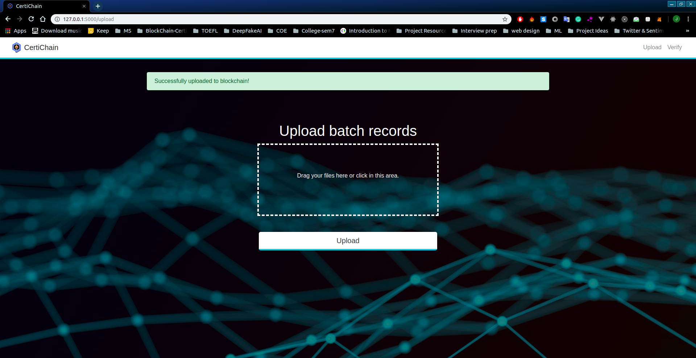
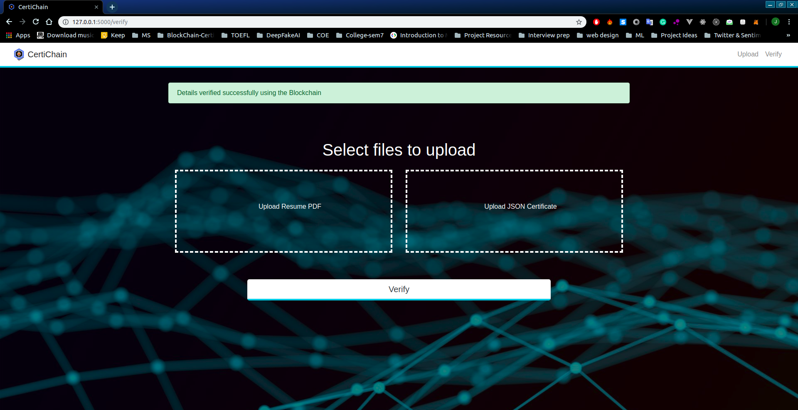

# CertiChain

 

A blockchain application to verify the essential documents required by the applicant for an interview process. This enhances the transparency and prevents any user from faking his identity. The blockchain technology provides immutability and publicly verifiable transactions, these  properties  of  Blockchain  can  be  used  to  generate  the  digital  certificate  which are  anti-counterfeit  and easy to verify.

## Working

A blockchain application to make the employee verification process easier for any employer. 

 

It constructs a Merkle Tree which contains nodes consisting of the hashes of the data given by the universities (Name, CPI, College Name and Year of Graduation). The root of this Merkle tree is then put on the Ethereum blockchain.

 

A smart contract is written to map the College and the Year of Graduation to the root hash, this contract is then deployed using Ganache, Ethereum local blockchain. 

## Institute Login

 

## Upload batch data

 

## Verify Applicant Details 

 

 

When the verifier uploads the applicants resume, it parses the resume and extracts significant details like Name, CPI, College Name and Year of Graduation using NLP techniques and stores it in a json format and creates a hash of that and combine it with the neighboring hashes and generates the root hash.
 

 

 

It then verifies this root hash with the hash on the blockchain and accordingly decides the validity of the resume.
 

## Features
A distributed and automated system for background verification could address several challenges in hiring:
- Assessing information accurately, without manual effort
- Depending on third-party vendors for verification, adding to hiring costs
- Inability to verify employment if the last place of work has gone out of business

Data  immutability  is  one  of  the  main features of blockchain.It  serves  as  a large  public ledger  where node  in network  verifies and save the same data. The process of certificate generation is an open and transparent system where any organization can verify information of any certificate using this system.In conclusion the system helps in eradicating problems of fake certificates.

## Contributors
- [@jcs98](https://github.com/jcs98)
- [@prachiti98  ](https://github.com/prachiti98)
- [@anshB1998 ](https://github.com/anshB1998)
- [@bhagwatmugdha](https://github.com/bhagwatmugdha)
